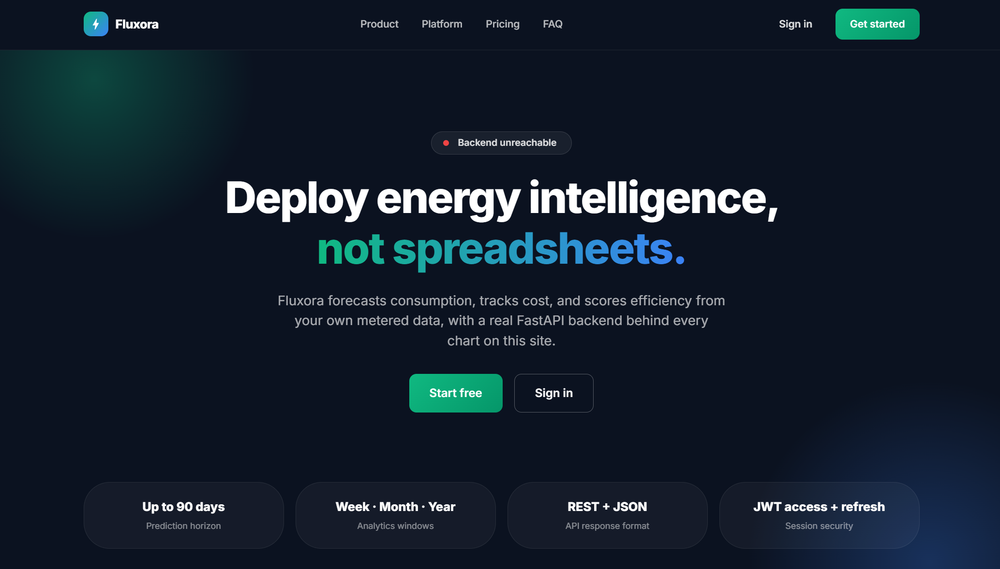

# Fluxora


## Energy Forecasting and Optimization Platform

Fluxora is an energy forecasting platform: a FastAPI backend for auth, data, analytics, and predictions, paired with a React web dashboard and a React Native (Expo) mobile app. Forecasting is a real, wired scikit-learn `RandomForestRegressor` (`code/ml_core`), trained and served directly by the API, not a disconnected library.

<div align="center">
  
</div>

## Table of Contents

- [Overview](#overview)
- [Project Structure](#project-structure)
- [Feature Status](#feature-status)
- [Technology Stack](#technology-stack)
- [Architecture](#architecture)
- [Installation and Setup](#installation-and-setup)
- [Running the Stack](#running-the-stack)
- [API Surface](#api-surface)
- [Testing](#testing)
- [CI/CD Pipeline](#cicd-pipeline)
- [Documentation](#documentation)
- [Contributing](#contributing)
- [License](#license)

## Overview

Fluxora demonstrates an energy forecasting workflow across a real, runnable codebase. The FastAPI backend and `ml_core` forecasting pipeline are wired and covered by tests. As shipped, the backend defaults to SQLite; Docker Compose provisions a MySQL container and a Redis container, but no MySQL or Redis client is installed or imported anywhere in the backend, so as wired the app doesn't actually use either one.

## Project Structure

```
Fluxora/
├── code/
│   ├── backend/               # FastAPI application
│   │   ├── app/api/v1/        # auth, data, analytics, predictions, users
│   │   ├── app/core/          # config, security (JWT)
│   │   ├── app/db/            # SQLAlchemy setup (SQLite by default)
│   │   └── tests/             # api, unit, and integration test suites
│   └── ml_core/                # Forecasting pipeline: data_validator,
│                                # feature_engineering, temporal_features,
│                                # training (scikit-learn RandomForestRegressor),
│                                # genuinely imported by the predictions API
├── web-frontend/                # React (Vite) dashboard
├── mobile-frontend/               # React Native (Expo) app, TypeScript
├── infrastructure/                 # Docker, Kubernetes, Terraform, Ansible, monitoring
├── scripts/                         # Setup, deploy, test, and monitoring scripts
├── docs/                             # Documentation (this directory)
└── README.md
```

## Feature Status

### Application tier (wired and tested)

| Component                | Details                                                                                                                                                                                                                                         |
| :----------------------- | :---------------------------------------------------------------------------------------------------------------------------------------------------------------------------------------------------------------------------------------------- |
| **API**                  | FastAPI backend exposing `/v1` endpoints for auth, data, analytics, predictions, and users.                                                                                                                                                     |
| **Auth**                 | JWT access and refresh tokens. `SECRET_KEY` falls back to a static placeholder value with no check that rejects it in production.                                                                                                               |
| **Forecasting pipeline** | A scikit-learn `RandomForestRegressor`, trained by `ml_core.training.run_training_pipeline` and genuinely called from the `/v1/predictions` endpoints for both training and inference, with real feature engineering and data validation steps. |
| **Data layer**           | SQLAlchemy over SQLite by default (`sqlite:///./fluxora.db`); a PostgreSQL driver is available but commented out in `requirements.txt`, so it must be uncommented to use Postgres.                                                              |
| **Web dashboard**        | React app (Vite) with Recharts, covering the core data, analytics, prediction, and authentication screens.                                                                                                                                      |
| **Mobile app**           | React Native (Expo) app in TypeScript, covering the equivalent core screens.                                                                                                                                                                    |

## Technology Stack

| Area             | Technology                                                                                |
| :--------------- | :---------------------------------------------------------------------------------------- |
| Backend API      | Python 3.10+, FastAPI, Uvicorn, Pydantic v2                                               |
| Auth             | python-jose (JWT)                                                                         |
| ML / forecasting | scikit-learn (RandomForestRegressor), pandas, NumPy, joblib                               |
| Data layer       | SQLAlchemy 2, SQLite by default; PostgreSQL available but not enabled by default          |
| Web frontend     | React 18, Vite, Recharts                                                                  |
| Mobile frontend  | React Native, Expo, TypeScript                                                            |
| Infrastructure   | Docker, Docker Compose, Kubernetes, Terraform, Ansible                                    |
| Monitoring       | Prometheus, Grafana                                                                       |
| CI/CD            | GitHub Actions                                                                            |
| Testing          | pytest (backend); the web and mobile frontends have Jest configured but no test files yet |

Docker Compose also provisions a MySQL container and a Redis container, but neither a MySQL client nor a Redis client is installed or imported anywhere in the backend, so as wired the app doesn't use either one; it runs on SQLite regardless of which containers are up.

## Architecture

```
Clients
  ├── web-frontend (React)               ── HTTP/JSON ──┐
  └── mobile-frontend (React Native)     ── HTTP/JSON ──┤
                                                        ▼
Backend (FastAPI, /v1)
  ├── Endpoints   auth, data, analytics, predictions, users
  ├── Core         config, JWT security
  └── Data layer     SQLite (SQLAlchemy) by default

Forecasting pipeline (code/ml_core, called directly by the predictions API)
  data_validator -> feature_engineering / temporal_features -> training
  (scikit-learn RandomForestRegressor)
```

See [docs/ARCHITECTURE.md](docs/ARCHITECTURE.md) for detail.

## Installation and Setup

Prerequisites: Python 3.9+ and Node.js 16+.

```bash
git clone https://github.com/abrar2030/Fluxora.git
cd Fluxora

# Backend (also installs ml_core's dependencies)
cd code/backend
python -m venv venv
source venv/bin/activate      # Windows: venv\Scripts\activate
pip install -r requirements.txt

# Web frontend
cd ../../web-frontend
npm install

# Mobile frontend
cd ../mobile-frontend
npm install
```

For an automated setup:

```bash
git clone https://github.com/abrar2030/Fluxora.git
cd Fluxora
./scripts/setup.sh
./scripts/start_services.sh
```

Full, environment-specific instructions are in [docs/INSTALLATION.md](docs/INSTALLATION.md).

## Running the Stack

```bash
# Full local stack (from infrastructure/, Docker required; note that the
# MySQL and Redis containers this starts aren't actually used by the backend)
docker compose up -d

# Or run the backend directly (from code/backend, venv active)
uvicorn app.main:app --reload      # serves http://0.0.0.0:8000, docs at /docs

# Web dashboard (from web-frontend)
npm run dev

# Mobile app (from mobile-frontend)
npx expo start
```

See [docs/USAGE.md](docs/USAGE.md) and [docs/CONFIGURATION.md](docs/CONFIGURATION.md).

## API Surface

Base URL `http://localhost:8000`. Interactive docs at `/docs` (Swagger) and `/redoc`.

| Group       | Prefix | Highlights                                                      |
| :---------- | :----- | :-------------------------------------------------------------- |
| Auth        | `/v1`  | `token`, `refresh`, `register`, `me`                            |
| Data        | `/v1`  | list/create, `query`, `{record_id}`                             |
| Analytics   | `/v1`  | list, `summary`                                                 |
| Predictions | `/v1`  | predict, `train`                                                |
| Users       | `/v1`  | list, `{user_id}`, `{user_id}/activate`, `{user_id}/deactivate` |

Full request and response shapes are in [docs/API.md](docs/API.md).

## Testing

```bash
# Backend (from code/backend)
pytest

# Web (from web-frontend)
npm test

# Mobile (from mobile-frontend)
npm test
```

The backend suite has 11 test files across api, unit, and integration categories. Neither the web dashboard nor the mobile app has any test files yet, though both have Jest configured.

## CI/CD Pipeline

GitHub Actions (`.github/workflows/cicd.yml`) runs three jobs on push, pull request, and manual dispatch:

| Job                 | Depends on          | What it does                                                                       |
| :------------------ | :------------------ | :--------------------------------------------------------------------------------- |
| Code Quality Checks | -                   | Python formatter checks (autoflake, black) and a repository-wide Prettier check    |
| Backend Tests       | Code Quality Checks | Runs the pytest suite with coverage and uploads the coverage report as an artifact |
| Frontend Build      | Code Quality Checks | Installs dependencies and produces the production web build (no test step)         |

There is currently no CI job for the mobile app.

## Documentation

| Document                                           | Contents                               |
| :------------------------------------------------- | :------------------------------------- |
| [docs/README.md](docs/README.md)                   | Documentation index                    |
| [docs/ARCHITECTURE.md](docs/ARCHITECTURE.md)       | System architecture                    |
| [docs/API.md](docs/API.md)                         | REST API reference                     |
| [docs/INSTALLATION.md](docs/INSTALLATION.md)       | Setup for all components               |
| [docs/CONFIGURATION.md](docs/CONFIGURATION.md)     | Environment variables and config       |
| [docs/USAGE.md](docs/USAGE.md)                     | Running and using the platform         |
| [docs/CLI.md](docs/CLI.md)                         | Helper scripts reference               |
| [docs/FEATURE_MATRIX.md](docs/FEATURE_MATRIX.md)   | Feature status, implemented vs planned |
| [docs/TROUBLESHOOTING.md](docs/TROUBLESHOOTING.md) | Common issues and fixes                |
| [docs/CONTRIBUTING.md](docs/CONTRIBUTING.md)       | Contribution guide                     |
| [docs/examples/](docs/examples/)                   | Worked examples                        |

## Contributing

See [docs/CONTRIBUTING.md](docs/CONTRIBUTING.md).

## License

This project is licensed under the MIT License - see the [LICENSE](LICENSE) file for details.
