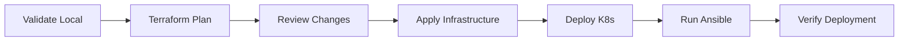

# Fluxora Infrastructure - Production Ready

This infrastructure has been audited, fixed, and hardened for production use.

## Prerequisites

Install the following tools:

```bash
# Terraform
wget https://releases.hashicorp.com/terraform/1.6.0/terraform_1.6.0_linux_amd64.zip
unzip terraform_1.6.0_linux_amd64.zip
sudo mv terraform /usr/local/bin/

# kubectl
curl -LO "https://dl.k8s.io/release/$(curl -L -s https://dl.k8s.io/release/stable.txt)/bin/linux/amd64/kubectl"
chmod +x kubectl
sudo mv kubectl /usr/local/bin/

# Helm
curl https://raw.githubusercontent.com/helm/helm/main/scripts/get-helm-3 | bash

# Ansible
pip install ansible ansible-lint

# Validation tools
pip install yamllint
go install github.com/aquasecurity/tfsec/cmd/tfsec@latest
wget https://github.com/instrumenta/kubeval/releases/latest/download/kubeval-linux-amd64.tar.gz
tar xf kubeval-linux-amd64.tar.gz
sudo mv kubeval /usr/local/bin/
```

## Quick Start

### 1. Terraform Infrastructure

```bash
cd terraform/

# Copy example configuration
cp terraform.tfvars.example terraform.tfvars

# Edit terraform.tfvars with your values
vim terraform.tfvars

# For local development, use local backend
cat > backend.tf << 'BACKEND'
terraform {
  backend "local" {
    path = "terraform.tfstate"
  }
}
BACKEND

# Initialize Terraform
terraform init

# Format code
terraform fmt -recursive

# Validate configuration
terraform validate

# Review plan
terraform plan -out=tfplan

# Apply (when ready)
# terraform apply tfplan
```

### 2. Kubernetes Deployment

```bash
cd kubernetes/

# Copy and configure secrets
cp base/app-secrets.yaml.example base/app-secrets.yaml
vim base/app-secrets.yaml  # Add your secrets

# Validate manifests
yamllint base/
kubeval base/*.yaml

# Dry-run deployment
kubectl apply --dry-run=client -f base/

# Apply to cluster (when ready)
# kubectl apply -f base/
```

### 3. Ansible Configuration

```bash
cd ansible/

# Copy inventory
cp inventory/hosts.yml.example inventory/hosts.yml
vim inventory/hosts.yml  # Add your hosts

# Test connectivity
ansible all -m ping -i inventory/hosts.yml

# Run playbook in check mode
ansible-playbook -i inventory/hosts.yml playbooks/main.yml --check

# Run playbook (when ready)
# ansible-playbook -i inventory/hosts.yml playbooks/main.yml
```

## Validation Commands

Run these commands to validate the infrastructure before deployment:

### Terraform Validation

```bash
cd terraform/
terraform fmt -check -recursive
terraform init -backend=false
terraform validate
tfsec .
```

Expected output:

```
Success! The configuration is valid.
No problems detected!
```

### Kubernetes Validation

```bash
cd kubernetes/
yamllint base/
kubeval base/*.yaml
kubectl apply --dry-run=client -f base/
```

### Ansible Validation

```bash
cd ansible/
ansible-lint playbooks/
ansible-playbook -i inventory/hosts.yml.example playbooks/main.yml --syntax-check
```

## Security Best Practices

1. **Never commit secrets** - Use `.example` files for templates
2. **Use external secrets management** - AWS Secrets Manager, HashiCorp Vault
3. **Enable encryption** - At rest and in transit
4. **Regular updates** - Keep dependencies and images updated
5. **Audit logs** - Enable and monitor audit logs
6. **Least privilege** - Use minimal IAM permissions

## Deployment Workflow



## Troubleshooting

### Terraform Issues

```bash
# Re-initialize if provider issues
rm -rf .terraform
terraform init

# Debug mode
TF_LOG=DEBUG terraform plan
```

### Kubernetes Issues

```bash
# Check pod status
kubectl get pods -n fluxora

# View logs
kubectl logs -n fluxora deployment/fluxora-backend

# Describe resources
kubectl describe pod -n fluxora POD_NAME
```

### Ansible Issues

```bash
# Verbose output
ansible-playbook -vvv playbooks/main.yml

# Check syntax
ansible-playbook --syntax-check playbooks/main.yml
```

## Support

For issues or questions, please open an issue in the repository.
